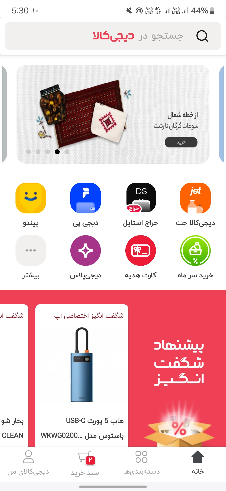
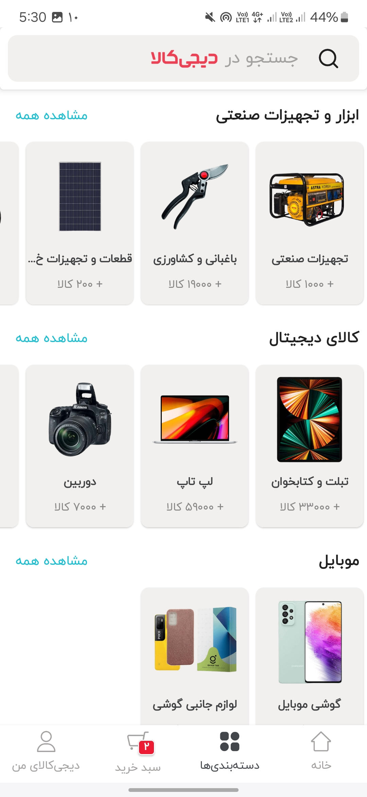
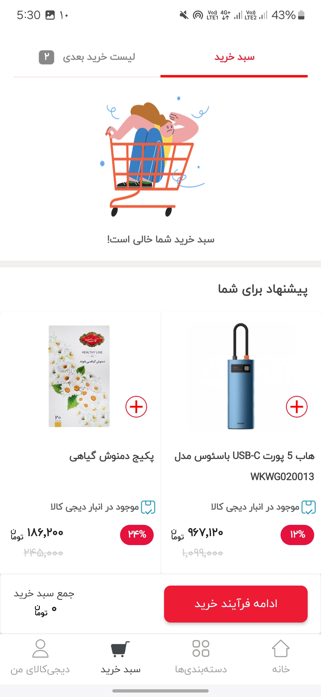
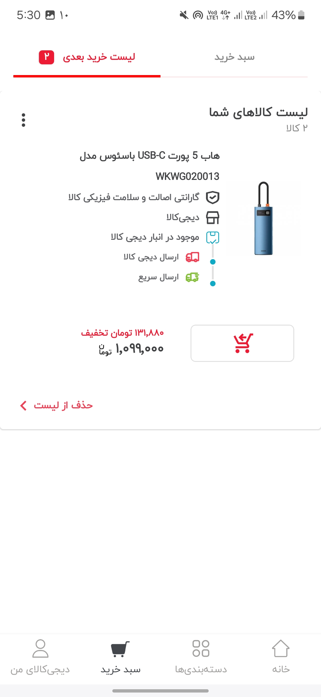

# 🛒 Digikala Sample (Refactored)

An Android e-commerce app inspired by **Digikala**, built entirely with **Kotlin** and **Jetpack Compose**.
This repository is the refactored version of the original project: cleaner structure, updated Gradle setup, and up-to-date dependencies.


---

## ✨ Features

- 🏠 Home screen with banners and product sections
- 🗂️ Categories and product listing
- 📦 Product details with user comments
- 🛍️ Shopping basket
- 💳 Full purchase flow: checkout, address selection, confirmation, and online payment (Zarinpal)
- 👤 User profile with editable user info and address management
- 📜 Orders history
- 📊 Charts (Vico)
- ⏳ Smooth loading states and Lottie animations
- 🔄 Pull-to-refresh and paginated lists

## 📸 Screenshots

<p align="center">
  
  
  
  
</p>

---

## 🧰 Tech Stack

| Area | Library |
|------|---------|
| UI | Jetpack Compose, Material, Material 3, Material Icons Extended |
| Navigation | Navigation Compose |
| Dependency Injection | Hilt (+ hilt-navigation-compose) |
| Networking | Retrofit, OkHttp Logging Interceptor, Gson |
| Local Database | Room |
| Preferences | DataStore |
| Pagination | Paging 3 (paging-compose) |
| Image Loading | Coil |
| Animations | Lottie Compose |
| Accompanist | SwipeRefresh, SystemUiController, Pager (+ indicators) |
| Serialization | kotlinx.serialization |
| Charts | Vico |
| Payment | Zarinpal Payment Provider |
| Annotation Processing | KSP |
| Testing | JUnit, Espresso, Compose UI Test |

## 🏗️ Architecture

The app follows **MVVM** with a layered structure:

```
UI (Compose screens)  →  ViewModel  →  Repository  →  Remote (Retrofit) / Local (Room, DataStore)
```

- **Hilt** provides dependencies across layers
- **StateFlow / Compose state** drives the UI
- **Repository pattern** abstracts network and database sources

## 🚀 Getting Started

### Requirements

- Android Studio (latest stable recommended)
- JDK 17
- Android SDK with a device or emulator running Android 7.0+ (adjust to your `minSdk`)

### Run the project

```bash
git clone https://github.com/amirdorri/digikalaRefactored.git
cd digikalaRefactored
```

1. Open the project in Android Studio
2. Let Gradle sync finish
3. Select a device or emulator
4. Press **Run ▶️**

### Configuration

If the app talks to a backend, set your API base URL and any keys (e.g. Zarinpal merchant ID) in the appropriate config file, and never commit real secrets.

## 📁 Project Structure

```
digikalaRefactored/
├── app/                 # Main Android module
├── digi files/          # Design / asset files
├── gradle/wrapper/      # Gradle wrapper
├── dependencies.txt     # Dependency reference list
├── build.gradle.kts
└── settings.gradle.kts
```

## 🔄 What Changed in the Refactor

- Updated Gradle and all dependencies to current versions
- Cleaned up project structure
- Fixed bugs in categories and comments
- Completed the purchase flow and profile screens

## 🗺️ Roadmap

- [ ] Unit and UI tests
- [ ] Dark theme polish
- [ ] Offline caching improvements
- [ ] Complete migration to Material 3

## 🤝 Contributing

Issues and pull requests are welcome. For major changes, please open an issue first to discuss what you'd like to change.

## 👤 Author

**Amir Dorri**
GitHub: [@amirdorri](https://github.com/amirdorri)

## ⚠️ Disclaimer

This is an educational project. It is not affiliated with or endorsed by Digikala.
